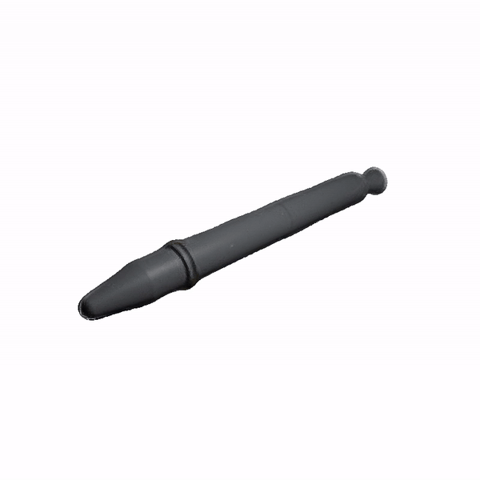
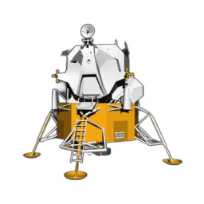
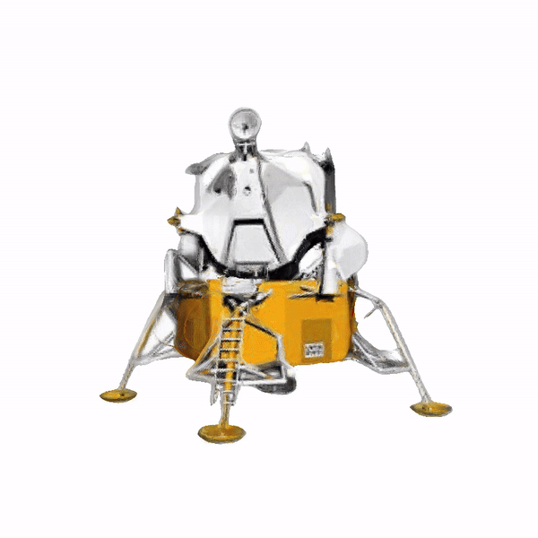
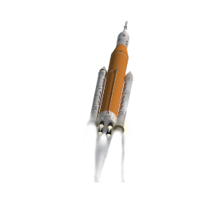
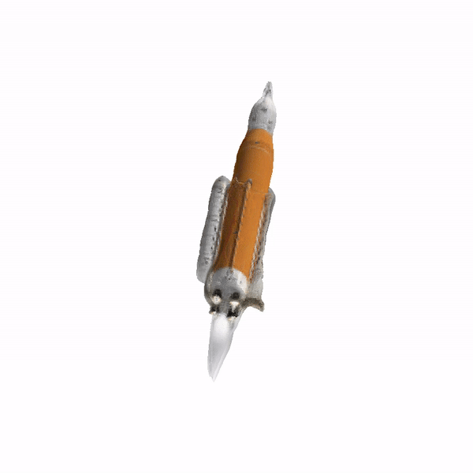

# space-nvs

| Spacecraft                  | Input                     | Generated Novel Views         |
|-----------------------------|---------------------------|-------------------------------|
| Explorer 1                  |  |  |
| Apollo Lunar Module         |  |  |
| Space Launch System Block 1 |  |  |

This repository contains the implementation steps for Toward a General Model for Novel View Synthesis (NVS) for space objects.

For data, 190 spacecraft 3D models from National Aeronautics and Space Administration (NASA), European Space Agency (ESA), and Synthetic Dataset for Satellites (SPE3R) datasets were used. Using the provided Blender file,  extract camera angles and json file using a data format required by Zero123 (https://github.com/cvlab-columbia/zero123).

Copy the data over to the GPU server. Clone the zero123 repository and upload the Zero123XL checkpoint. Make sure to update simple.py file to adjust train/validation split.
Run the finetuning (download missing packages if prompted) and save the finetuned model
python main.py \
    -t \
    --base configs/sd-objaverse-finetune-c_concat-256.yaml \
    --gpus 0,1,2,3,4 \
    --scale_lr False \
    --num_nodes 1 \
    --seed 42 \
    --check_val_every_n_epoch 10 \
    --finetune_from zero123-xl.ckpt

Clone the DreamGaussian repository (https://github.com/dreamgaussian/dreamgaussian). Then, upload  checkpoint and config files and adjust model paths in main.py, main2.py, and any other files needed to use the finetuned model instead of the original Zero123XL

CLIP similarity can be calculated through running python -m kiui.cli.clip_sim example_rgba.png example.obj. The script to calculate LPIPS, PSNR, SSIM is provided in this repository.

# Resources

## Papers
- K. Chang and J. Fletcher, “Learned Satellite Radiometry Modeling from Linear Pass Observations,” Sep. 2023.
- J. Luiten, G. Kopanas, B. Leibe, and D. Ramanan, “Dynamic 3D Gaussians: Tracking by Persistent Dynamic View Synthesis.” arXiv, Aug. 18, 2023. doi: 10.48550/arXiv.2308.09713.
- B. Kerbl, G. Kopanas, T. Leimkühler, and G. Drettakis, “3D Gaussian Splatting for Real-Time Radiance Field Rendering.” arXiv, Aug. 08, 2023. doi: 10.48550/arXiv.2308.04079.
- B. Caruso, T. Mahendrakar, V. M. Nguyen, R. T. White, and T. Steffen, “3D Reconstruction of Non-cooperative Resident Space Objects using Instant NGP-accelerated NeRF and D-NeRF.” arXiv, Jun. 09, 2023. doi: 10.48550/arXiv.2301.09060.
- C. Smith, Y. Du, A. Tewari, and V. Sitzmann, “FlowCam: Training Generalizable 3D Radiance Fields without Camera Poses via Pixel-Aligned Scene Flow.” arXiv, May 31, 2023. doi: 10.48550/arXiv.2306.00180.
- Z. Li, Q. Wang, F. Cole, R. Tucker, and N. Snavely, “DynIBaR: Neural Dynamic Image-Based Rendering.” arXiv, Apr. 24, 2023. doi: 10.48550/arXiv.2211.11082.
- E. R. Chan et al., “Generative Novel View Synthesis with 3D-Aware Diffusion Models.” arXiv, Apr. 05, 2023. doi: 10.48550/arXiv.2304.02602.
- A. Mergy, G. Lecuyer, D. Derksen, and D. Izzo, “Vision-based Neural Scene Representations for Spacecraft.” arXiv, May 11, 2021. doi: 10.48550/arXiv.2105.06405.
- J. Lucas, T. Kyono, J. Yang, and J. Fletcher, “Discovering 3-D Structure of LEO Obects,” 2021.
